# kottans-frontend

# 0. Git Basics

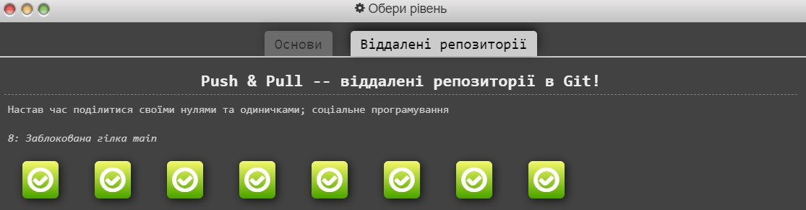
 Git Basics — #done

## Linux CLI, and HTTP
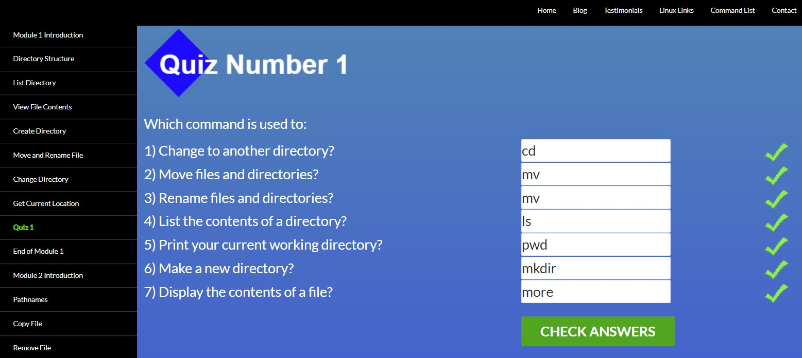
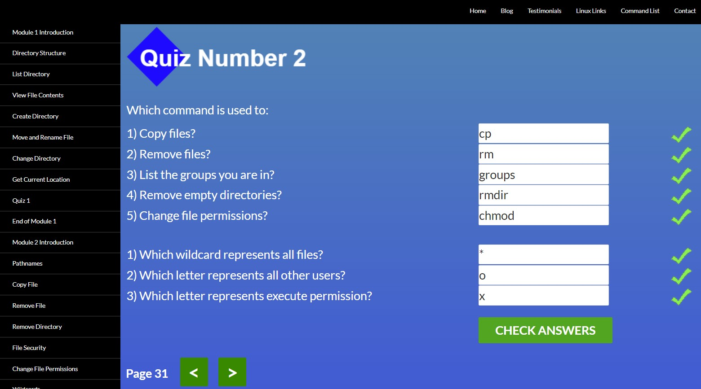
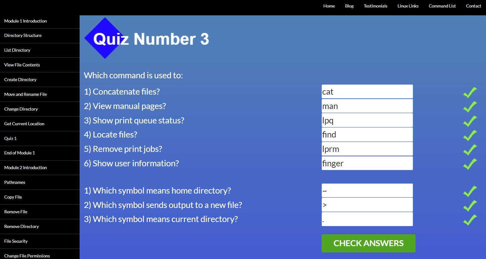
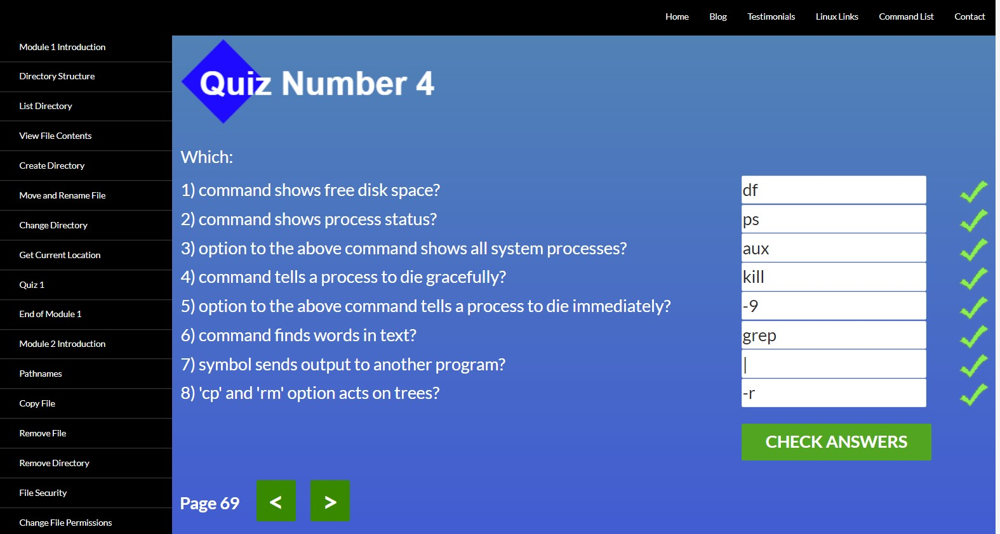
Linux CLI and HTTP — #done

## Git Collaboration
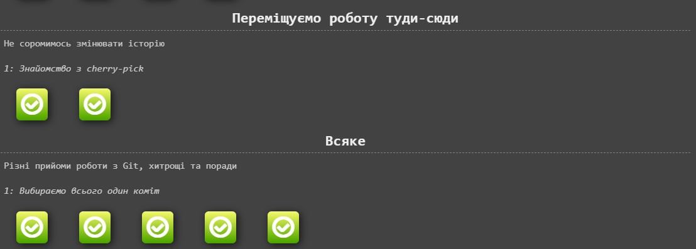
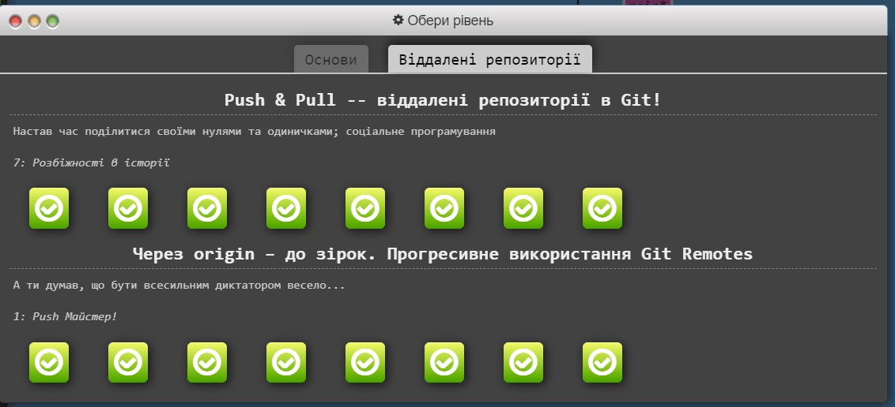
Git Collaboration — #done

## Intro to HTML and CSS
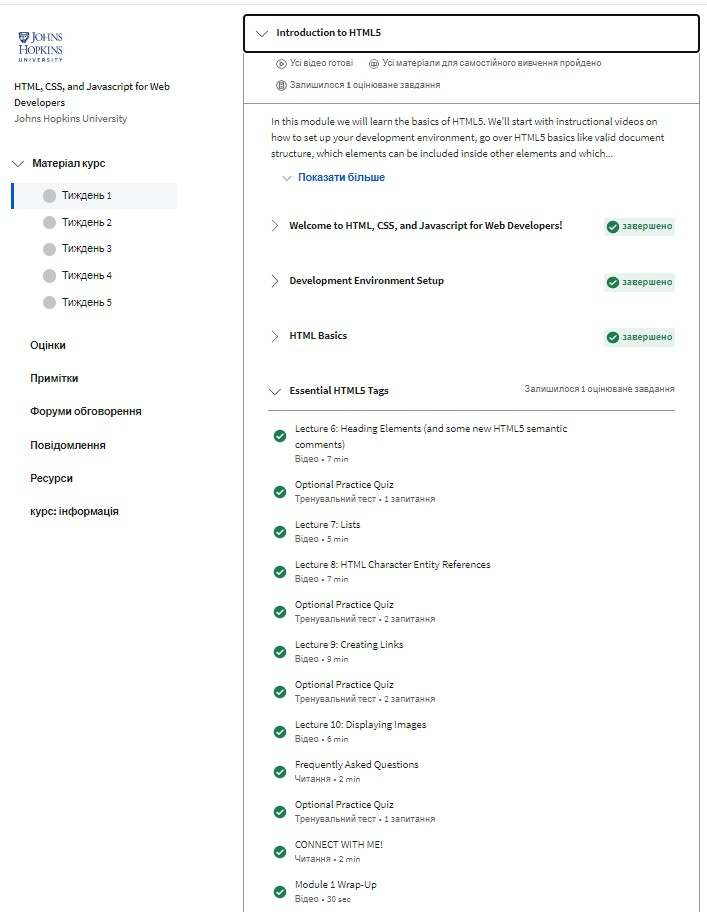
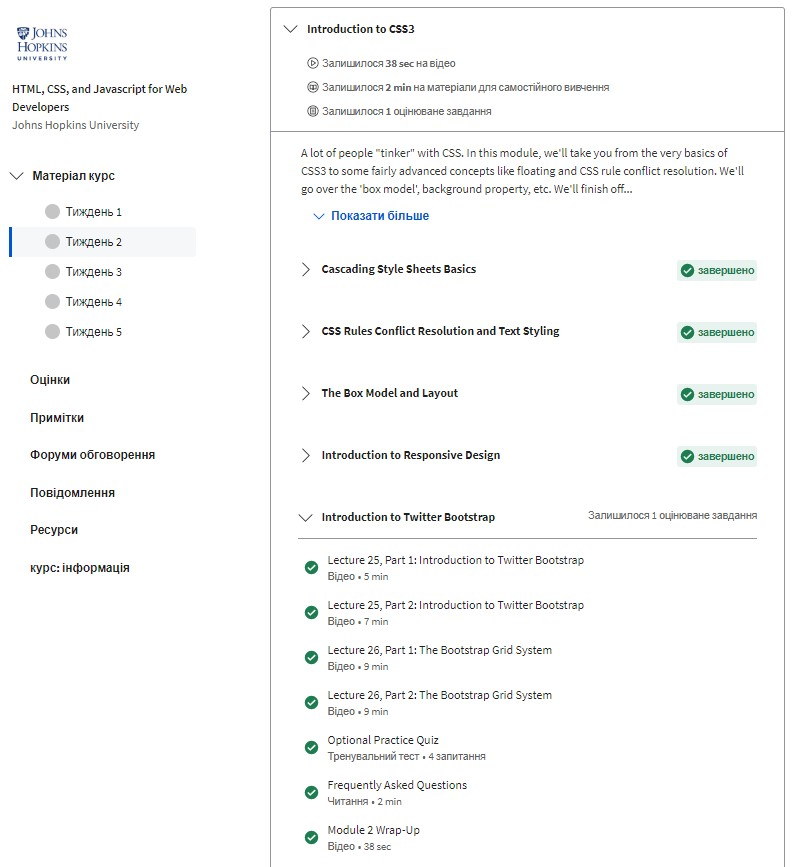
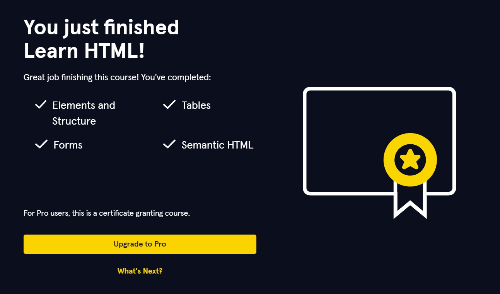
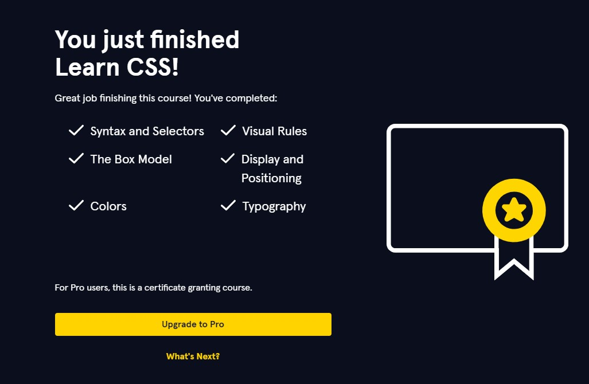
Intro to HTML and CSS — #done

## Responsive Web Design
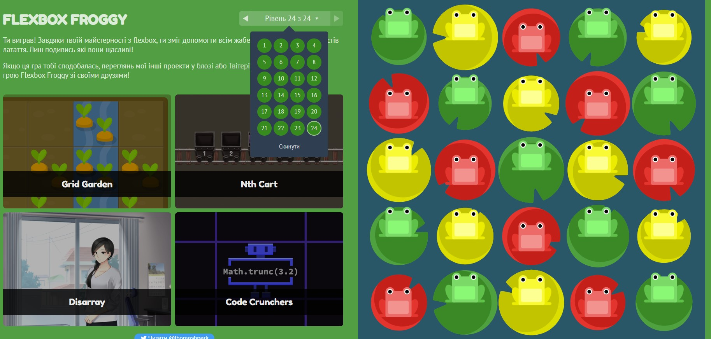
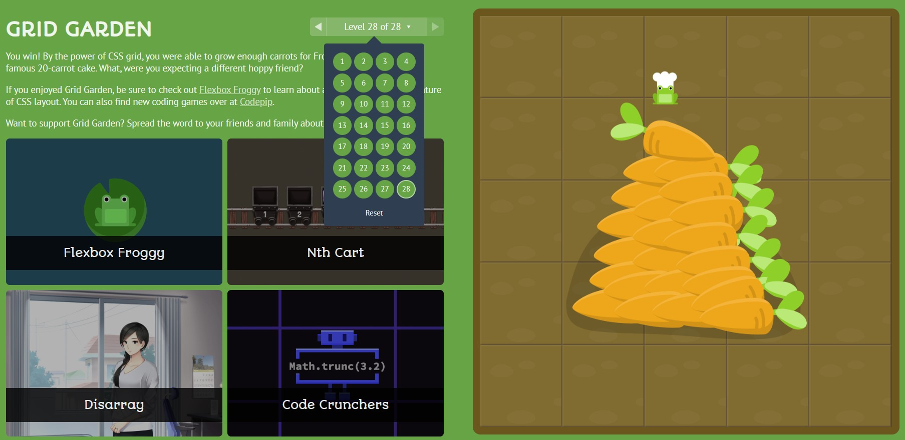
Responsive Web Design — #done